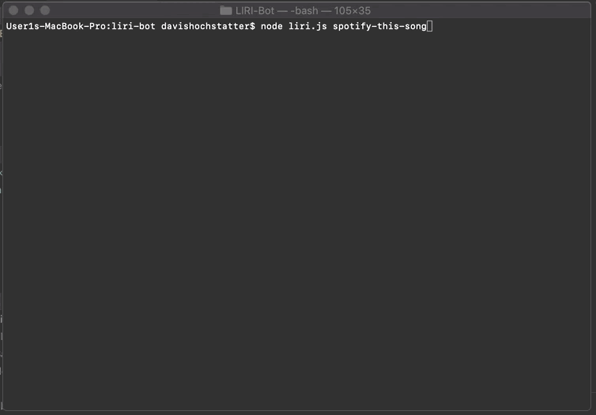
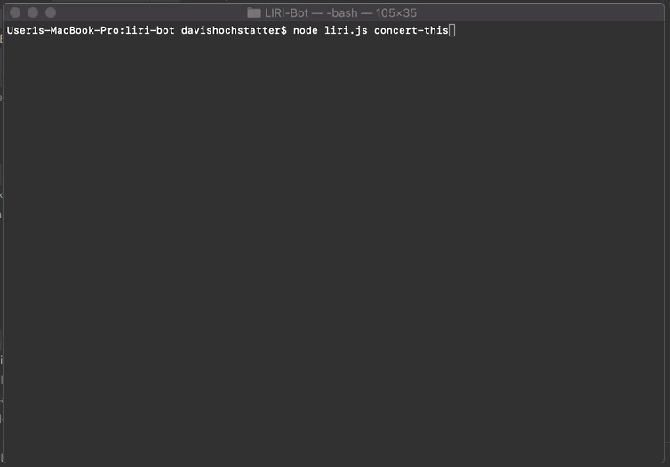
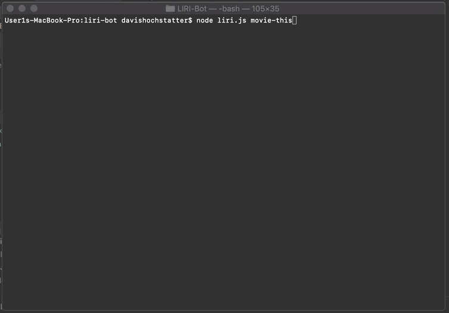

# LIRI-BOT

LIRI is a lot like SIRI except not speech recognition or on a phone but rather commands from the command line that does
3 maybe 4 things. So maybe its not like SIRI. It can search spotify for song information, IMDB for movie information, 
Bandsintown for concert information, or read a txt file for search type and search information.


```
Here is an example of the spotify functionality.
```



```
Here is an example of the concert functionality.
```



```
Here is an example of the movie functionality.
```



```
Here is an example of the reading a text file functionality.
```


## Authors

* **Davis Hochstatter** - 


* Hat tip to anyone whose code was used
* Inspiration
* etc
