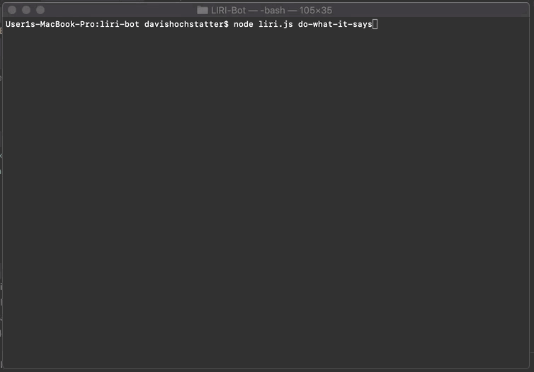

# LIRI-BOT

LIRI is a lot like SIRI except not speech recognition or on a phone but rather commands from the command line that does
3 maybe 4 things. So maybe its not like SIRI. It can search spotify for song information, IMDB for movie information, 
Bandsintown for concert information, or read a txt file for search type and search information.

This app utilizes Spotify, OMDB, and Bandsintown API's. 

```
Here is an example of the spotify functionality.
```


```
Here is an example of the concert functionality.
```


```
Here is an example of the movie functionality.
```


```
Here is an example of the reading a text file functionality.
```




## Instructions

To utilize this bot to it's full extent, you must provide your own environment files or some other way of containing 
your own API keys. Other then that, if you know what you're doing, then need I say more.

## Authors

* **Davis Hochstatter** - 

